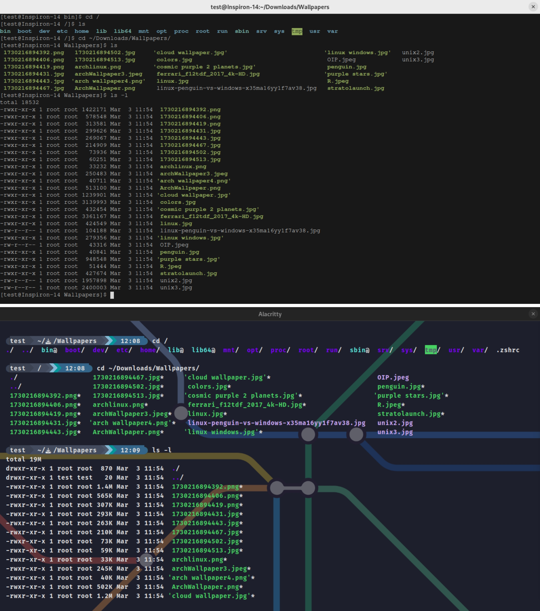
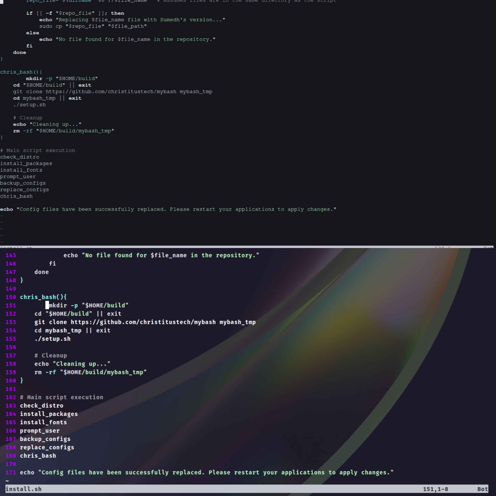
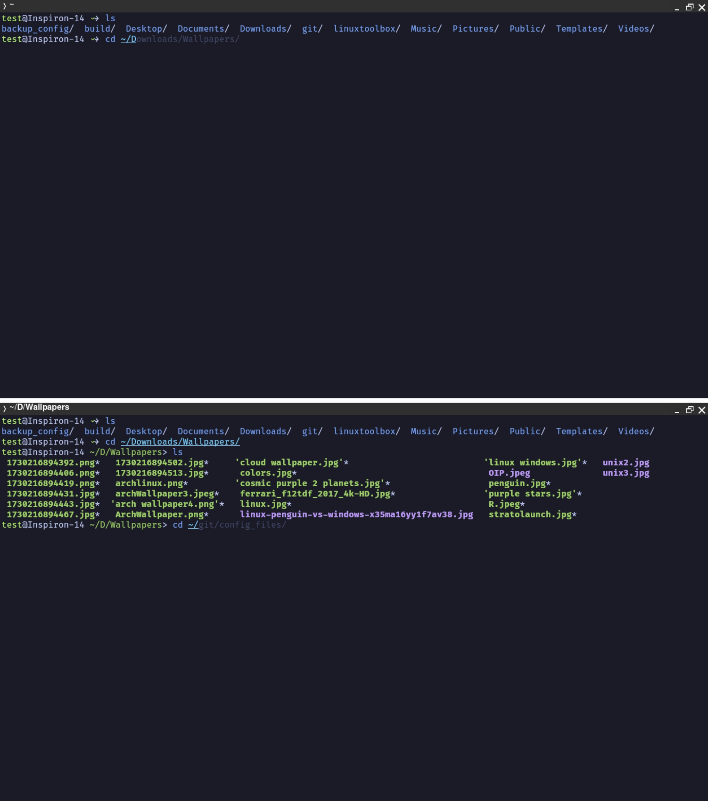
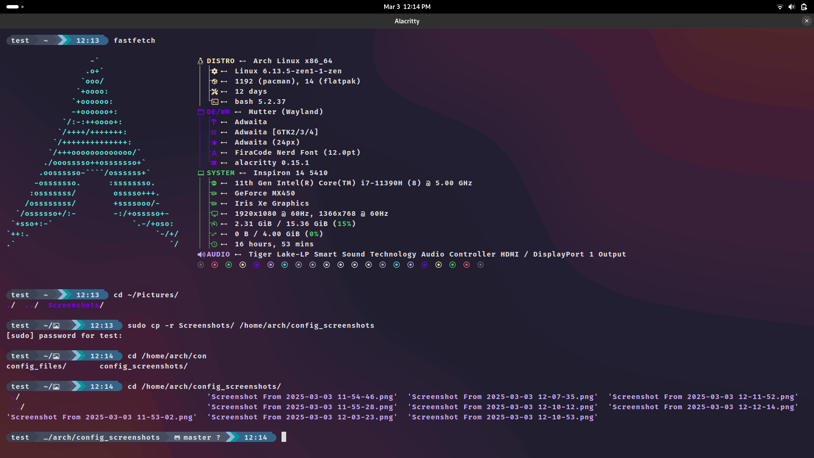

# 🖥️ Sumedh's Configurations for Arch Linux 🏴

## Overview
This repository contains configuration files for various applications on **Arch Linux** 🏴. The included Bash script automates the installation of required packages and replaces existing configurations with **Sumedh's custom settings**. The script also backs up your old configuration files to `~/config_backup` before making any changes.

## 🛠️ Supported Applications
The following applications will be installed (if not already) and configured:
- 🐧 **Bash** → New customized Bash configuration
- 🖥️ **Alacritty** → New Alacritty terminal configuration
- 🖥️ **Kitty** → New Kitty terminal configuration
- ✨ **Neovim** → New Neovim setup
- 🐟 **Fish** → New Fish shell configuration
- 📦 **Pacman** → Updated `/etc/pacman.conf`

## 📸 Screenshots
Here are some previews of the configurations in action:

- **Alacritty:**  
  


  

- **Bash:**  
  


  

- **Neovim:**  
  


- **Fish Shell:**  
  


  

- **overview:**
  


  

## 📌 Installation

### **Step 1: Update the System**
```bash
pacman -Syu
```

### **Step 2: Clone the Repository**
```bash
cd ~
git clone https://github.com/shetesumedh/config_files.git
cd config_files
```

### **Step 3: Run the Script**
```bash
./install.sh
```

## ⚠️ Warning
- This script **replaces** your existing config files. A backup will be stored in `~/config_backup`.
- Ensure you are running **Arch Linux** 🏴, as the script uses `pacman` for package installation.
- Review the script before running to avoid unintended changes.

## 📜 Notes
- The Bash configuration is updated using [ChrisTitusTech's mybash](https://github.com/ChrisTitusTech/mybash).
- If you face issues, restore your old configs from `~/config_backup`.

## Contact

https://www.linkedin.com/in/sumedh-shete-bb7854232/
## 📄 License
This repository is open-source. Feel free to modify and share!

